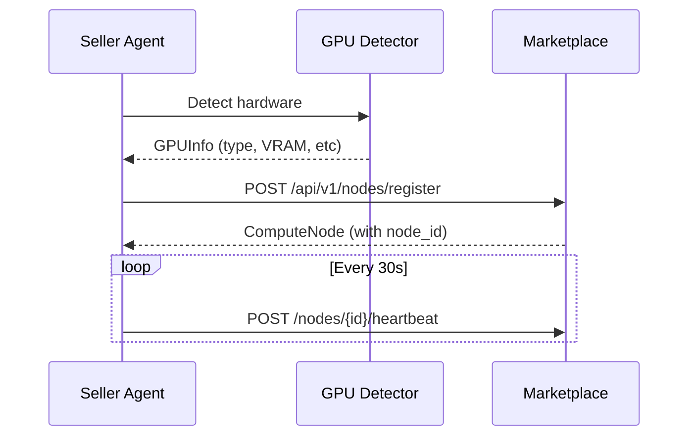
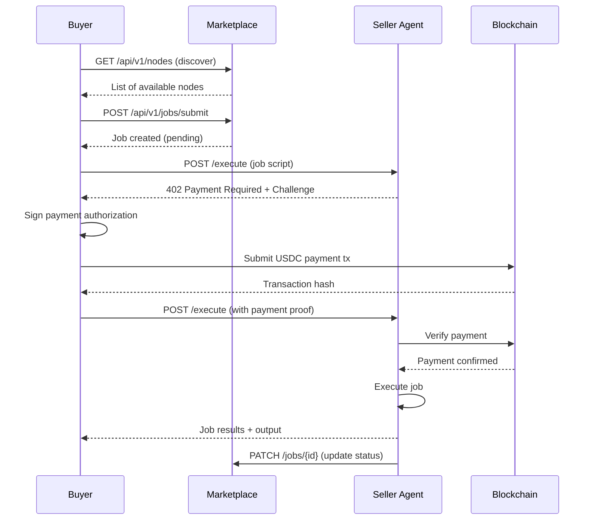

# ComputeSwarm Architecture

This document describes the system architecture, data flow, and design decisions for ComputeSwarm.

## System Overview

ComputeSwarm is a three-tier decentralized marketplace:

```
┌─────────────────────────────────────────────────────────┐
│                    Marketplace Layer                     │
│  (Central Discovery, No Payment Processing)              │
│  - Node Registry                                         │
│  - Job Tracking                                          │
│  - x402 Manifest                                         │
└────────────────┬─────────────────┬──────────────────────┘
                 │                 │
        ┌────────▼─────┐   ┌──────▼────────┐
        │ Seller Agent │   │  Buyer Client │
        │  (Provider)  │   │  (Consumer)   │
        └────────┬─────┘   └──────┬────────┘
                 │                 │
                 │   ┌─────────────▼───────────┐
                 │   │  x402 Payment Protocol  │
                 │   │  (Direct P2P, On-chain) │
                 │   └─────────────┬───────────┘
                 │                 │
                 └─────────────────┘
                   Direct Payment Flow
```

## Core Components

### 1. Marketplace Server

**Technology:** FastAPI + Uvicorn

**Responsibilities:**
- Maintain registry of available GPU nodes
- Expose x402.json protocol manifest
- Facilitate node discovery for buyers
- Track job metadata (not execution)
- Provide health monitoring and statistics

**Key Design Decisions:**
- **Stateless**: Uses in-memory storage (Phase 1), easily upgradeable to database
- **No Payment Processing**: Marketplace never touches funds
- **Minimal Trust**: Only facilitates discovery, not execution

**API Endpoints:**
```
GET  /                       - API info
GET  /x402.json              - x402 protocol manifest
GET  /health                 - Health check
POST /api/v1/nodes/register  - Register GPU node
GET  /api/v1/nodes           - Discover nodes
POST /api/v1/nodes/{id}/heartbeat - Node heartbeat
POST /api/v1/jobs/submit     - Submit job metadata
GET  /api/v1/jobs/{id}       - Get job status
GET  /api/v1/stats           - Marketplace statistics
```

**Data Models:**
- `ComputeNode`: GPU hardware specs, pricing, seller address
- `Job`: Job request, status, payment info
- `GPUInfo`: Hardware details (type, VRAM, capabilities)

### 2. Seller Agent

**Technology:** Python asyncio + PyTorch

**Responsibilities:**
- Detect local GPU hardware (CUDA/MPS)
- Register with marketplace
- Listen for job requests
- Execute compute jobs in isolation
- Issue x402 payment challenges
- Verify payment before execution
- Stream results back to buyer

**Architecture:**
```
┌─────────────────────────────────────┐
│         Seller Agent                │
│                                     │
│  ┌─────────────┐  ┌──────────────┐ │
│  │   GPU       │  │  Marketplace │ │
│  │  Detector   │  │  Connector   │ │
│  └──────┬──────┘  └──────┬───────┘ │
│         │                 │         │
│  ┌──────▼─────────────────▼──────┐ │
│  │     Job Execution Engine      │ │
│  │  - Isolation                  │ │
│  │  - Resource Limits            │ │
│  │  - Output Capture             │ │
│  └──────┬────────────────────────┘ │
│         │                           │
│  ┌──────▼──────────────────────┐   │
│  │   x402 Payment Verifier     │   │
│  │  - Challenge Generation     │   │
│  │  - Signature Verification   │   │
│  │  - On-chain Confirmation    │   │
│  └─────────────────────────────┘   │
└─────────────────────────────────────┘
```

**Lifecycle:**
1. Startup: Detect GPU → Register with marketplace
2. Running: Send heartbeats → Wait for jobs
3. Job Received: Issue payment challenge
4. Payment Verified: Execute job
5. Completion: Return results → Update stats
6. Shutdown: Unregister from marketplace

### 3. Buyer CLI

**Technology:** Python asyncio + Rich (TUI)

**Responsibilities:**
- Discover available compute nodes
- Submit job requests
- Handle x402 payment flow
- Monitor job status
- Display results

**User Flows:**

**Discovery Flow:**
```
User → discover → Marketplace API → Display nodes table
```

**Job Submission Flow:**
```
User → submit job → Marketplace (get node info)
                 → Seller endpoint (submit)
                 → Receive 402 Payment Required
                 → Sign payment authorization
                 → Resubmit with payment proof
                 → Job executes
                 → Poll for status
                 → Display results
```

## Data Flow

### Node Registration



### Job Submission (x402 Flow)



## x402 Protocol Integration

### Payment Challenge Structure

```json
{
  "challenge_id": "chg_uuid",
  "amount_usd": 0.0042,
  "amount_usdc": "4200000000000000",
  "seller_address": "0x742d35...",
  "buyer_address": "0x123abc...",
  "job_id": "job_uuid",
  "expires_at": "2025-01-01T12:30:00Z",
  "payment_details": {
    "chain": "base-sepolia",
    "token": "USDC",
    "contract": "0x036CbD..."
  }
}
```

### Payment Proof Structure

```json
{
  "challenge_id": "chg_uuid",
  "signature": "0xabcd...",
  "transaction_hash": "0x1234...",
  "timestamp": "2025-01-01T12:29:45Z"
}
```

## Security Architecture

### Threat Model

1. **Malicious Job Code**: Buyer submits harmful script
2. **Payment Fraud**: Buyer tries to execute without paying
3. **Node Impersonation**: Fake seller claims to have GPU
4. **Replay Attacks**: Reuse old payment proofs
5. **DDoS**: Overwhelm marketplace or sellers

### Mitigations

| Threat | Mitigation | Implementation |
|--------|------------|----------------|
| Malicious Code | Sandboxed execution | Docker containers (Phase 2) |
| Payment Fraud | Cryptographic verification | x402 signature + on-chain check |
| Node Impersonation | Wallet signatures | Seller signs with registered address |
| Replay Attacks | Challenge expiration + nonces | 5min TTL, unique challenge IDs |
| DDoS | Rate limiting | FastAPI middleware (configured) |

### Job Isolation (Phase 2)

```
┌─────────────────────────────────┐
│     Seller Agent Host           │
│                                 │
│  ┌───────────────────────────┐ │
│  │  Docker Container         │ │
│  │  - No network access      │ │
│  │  - Limited CPU/Memory     │ │
│  │  - Read-only filesystem   │ │
│  │  - 1-hour timeout         │ │
│  │                           │ │
│  │  ┌─────────────────────┐ │ │
│  │  │   User Job Script   │ │ │
│  │  └─────────────────────┘ │ │
│  └───────────────────────────┘ │
└─────────────────────────────────┘
```

## Performance Considerations

### Scalability

**Current (Phase 1):**
- In-memory storage: ~10,000 nodes max
- Single marketplace instance
- No caching

**Future (Production):**
- PostgreSQL/Redis: millions of nodes
- Load-balanced marketplace
- CDN for x402 manifest

### Latency Targets

| Operation | Target | Current |
|-----------|--------|---------|
| Node discovery | <100ms | ~50ms |
| Job submission | <200ms | ~150ms |
| Payment verification | <2s | TBD |
| Heartbeat | <50ms | ~30ms |

## Monitoring & Observability

### Metrics Collected

**Marketplace:**
- Total nodes registered
- Active nodes (by GPU type)
- Total jobs submitted/completed
- Average job duration
- Payment success rate

**Seller Agent:**
- GPU utilization
- Jobs completed
- Revenue earned
- Uptime

**Structured Logging:**
```python
logger.info("job_completed",
    job_id=job_id,
    duration_seconds=duration,
    cost_usd=cost,
    buyer=buyer_address
)
```

## Future Enhancements

### Phase 2: Production Ready
- Database persistence (PostgreSQL)
- Docker-based job isolation
- TLS/HTTPS everywhere
- Multi-region marketplace

### Phase 3: Advanced Features
- Reputation system
- Job scheduling queue
- Batch job support
- Real-time result streaming (WebSocket)
- Dynamic pricing (supply/demand)

### Phase 4: Decentralization
- Multi-marketplace federation
- DHT-based node discovery
- Smart contract escrow
- Governance tokens
